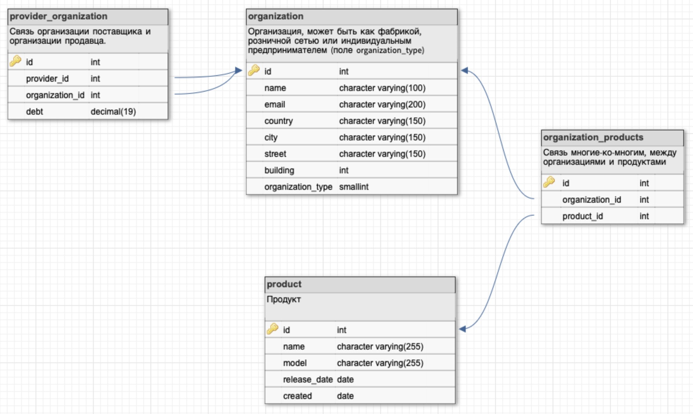

# <p align="center">Electronics trade</p>
### Веб-приложение, с API интерфейсом реализующий модель сети по продаже электроники
___
[](https://www.python.org/downloads/release/python-394/)
[](https://docs.djangoproject.com/en/4.2/releases/4.0.1/)
[](https://www.postgresql.org/docs/12/release-12-4.html)
[](https://github.com/astral-sh/ruff)
___
### Подготовка приложения к запуску
1. Установка зависимостей
```shell
python3 -m pip install poetry &&
poetry install
```
2. В файле [.env.example](.env.example) находятся переменые окружения необходимые для запуска БД и самого проекта.
3. Запуск БД через docker-compose
```shell
docker-compose --env-file .env.local -f infra/docker-compose.yml up -d
```
4. Применить миграции
```shell
python3 electronics_trade/manage.py migrate
```
5. Для удобства были подготовлены csv-таблицы которые находятся в директории [datasets](./datasets). 
В данных таблицах при необходимости можно добавить, убавить или изменить имеющиеся данные. 
Также создан [скрипт](./csv_to_json.py) для формирования [фикстур](./fixtures) из таблиц. Для загрузки данных в БД сначала нужно сформировать фикстуры:
```shell
python3 csv_to_json.py
```
И непосредственно загрузить сформированные json файлы в БД:
```shell
python3 electronics_trade/manage.py loaddata fixtures/*.json
```
6. Запуск приложения:
```shell
python3 electronics_trade/manage.py runserver
```
___
### Структура приложения
Доступ к самому API реализуется через Basic Auth. 

По URL приложения:

| url                                      | Описание                                                                      |
|------------------------------------------|-------------------------------------------------------------------------------|
| http://localhost:8000/admin/             | Панель администрирования                                                      |
| http://localhost:8000/orgs/organization/ | Представления для всех организация                                            |
| http://localhost:8000/orgs/product/      | Представления для продуктов                                                   |
| http://localhost:8000/orgs/provider/     | Представления для всех организация являющиеся поставщиками                    |
| http://localhost:8000/docs/              | Swagger. В нем можно подробнее ознакомится доступными с роутами и их методами |
| http://localhost:8000/docs/schema/       | Схема Swagger`а в формате YAML                                                |

Схема базы данных приложения [orgs](./electronics_trade/orgs/models.py) выглядит следующим образом:

Имеется также отдельно пользовательское приложение [users](./electronics_trade/orgs/models.py), его модель наследуется от AbstractUser
___
### Критерии выполнения работы
- [x] **Реализована модель сети по продаже электроники представляющею собой иерархическую структуру из 3 уровней**
- [x] **Каждое звено сети обладает элементами перечисленными в ТЗ**
- [x] **Сделан вывод в админ-панели созданных объектов, со следующими требованиями:**
  - [x] у организаций есть ссылка на «Поставщика» (только у тех у которых он есть);
  - [x] фильтрация организаций по названию города;
  - [x] «admin action», очищающий задолженность перед поставщиком у выбранных объектов.
- [ ] **При помощи DRF, созданы следующие представления:**
  - [ ] CRUD для модели поставщика (обновление через API поля «Задолженность перед поставщиком» не доступно исходя из структуры БД и запроса к ней);
  - [x] добавлена возможность фильтрации объектов по определенной стране.
- [x] **Права доступа к API настроены так, чтобы только активные сотрудники имели доступ к API.**